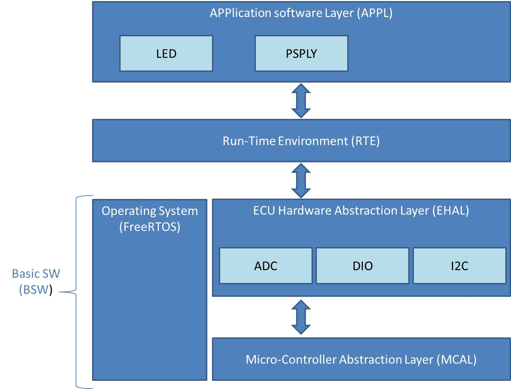

# Temperature Indicator
This repository contains the source codes of Temperature Indicator. 

## Functionalities
The main functionality is to indicate the current temperature. When the below pre-conditions are met, the green LED will be on if the temperature is higher than 25 degree. The red LED will be on if the temperature is lower than 25 degree. 
The current temperature value is sent over to the USART hardware. A PC can read it via a COM port using a USB-USART bridge. 

.Pre-condition 1: The MCU gets a stable voltage.

.Pre-condition 2: User pushes the external button connected to the MCU.

## HW Spec.
Microcontoller: STM32F4

Temperature sensor: MPU-6050

## SW Architecture

FreeRTOS is used as Real-time OS and the basic AUTOSAR architecture is applied to decrease hardware dependencies. It consists of the three layers, Application software layer (APPL), Run-time environment (RTE), Basic software layer (BSW). RTE just serves as an interface between APPL and BSW. The architecture decouples APPL from the hardware so that reusability is ensured. Runnables are called by RTOS instead of RTE. 

## SWUnits
### LED
It implements the main functionality. It checks if the two pre-conditions are fulfilled. It turns the green LED on and the red LED off if the temperature is higher than 25 degree. Otherwise, it turns the green LED off and the red LED on.

### PSPLY
It determines the status of power supply. If the MCU gets a stable voltage, the status will be set to Operation mode. Otherwise, it will be set to Non-operation mode.

### ADC
It reads the voltage level of power by Analog-to-Digital Converter. Every 5ms the voltage is measured and recorded. Every 50ms recorded voltage values are evaluated to see if it is stable.  

### DIO
It forms the interface towards the GPIO hardware by calling the driver APIs. 

### I2C
It represents abstraction of signals (Temperature, Accelerometer, Gyroscpoe) measured by the MPU-6050 sensor. It communicates with the sensor via I2C protocol by calling the driver APIs.

### USART
It sends a measured temperature value to the USART hardware every 50ms.